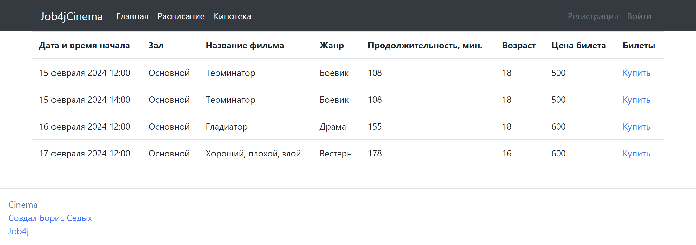
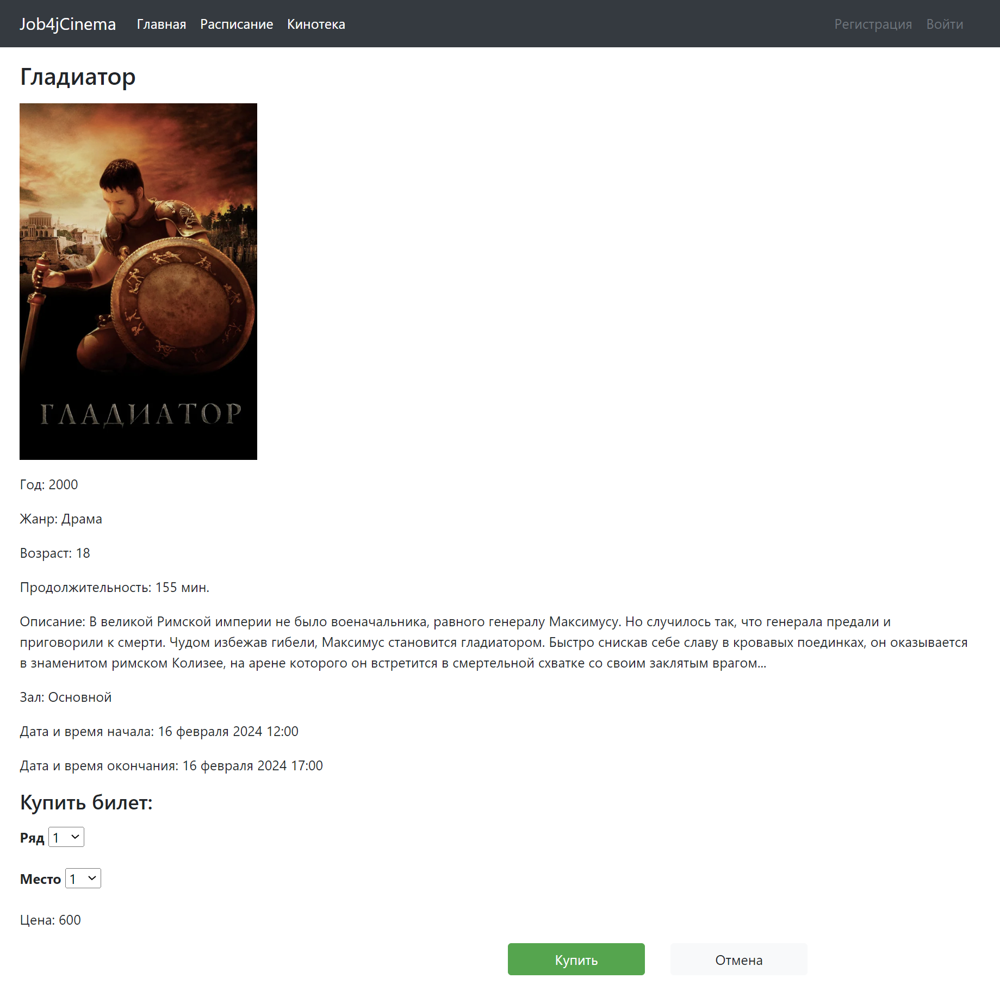
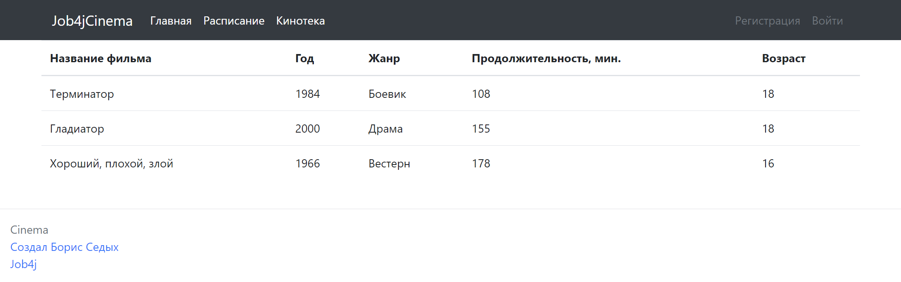
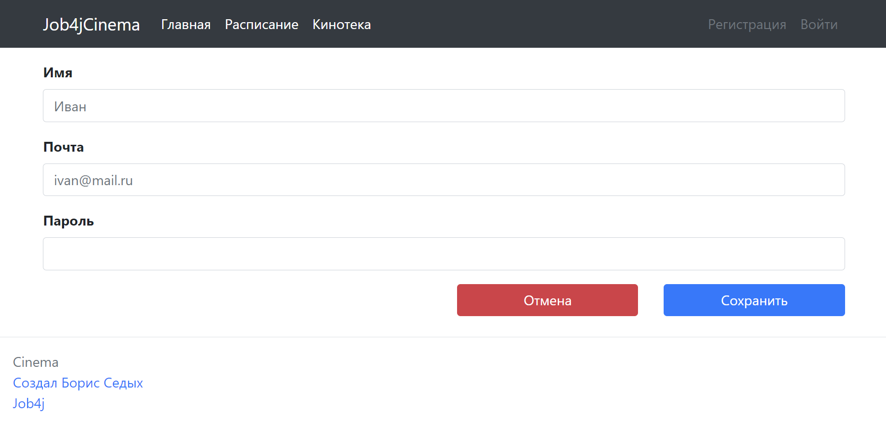

# job4j_cinema
В рамках проекта разработан сайт для покупки билетов в кинотеатр. Основные функции:
- Регистрация / вход пользователей
- Просмотр киносеансов и списка показываемых фильмов
- Покупка билета на сеанс

## Используемые технологии
- Java 17, Spring Boot 2.7.18 (Web, Thymeleaf, Test)
-  PostgreSQL 16.1, Liquibase 4.15.0, Sql2o 1.6.0, DBCP 2.9.0

## Требования к окружению
- Java 17
- Maven 3.9.5
- PostgreSQL 16.1

## Запуск проекта
1. Создать новую базу данных **cinema**.
2. Перейти в папку с проектом.
3. В файлах **db/liquibase.properties**, **src/main/resources/application.properties** скорректировать настройки подключения к БД **cinema**.
4. Создать схему базы данных:

    `mvn -P production liquibase:update`

5. Создать jar:

    `mvn package`

6. Запустить программу: 

    `java -jar target/job4j_cinema-1.0-SNAPSHOT.jar`

7. Перейти в браузере по адресу: http://localhost:8080/

## Примеры страниц
### Расписание сеансов:

### Покупка билета:

### Кинотека:

### Регистрация пользователя:

